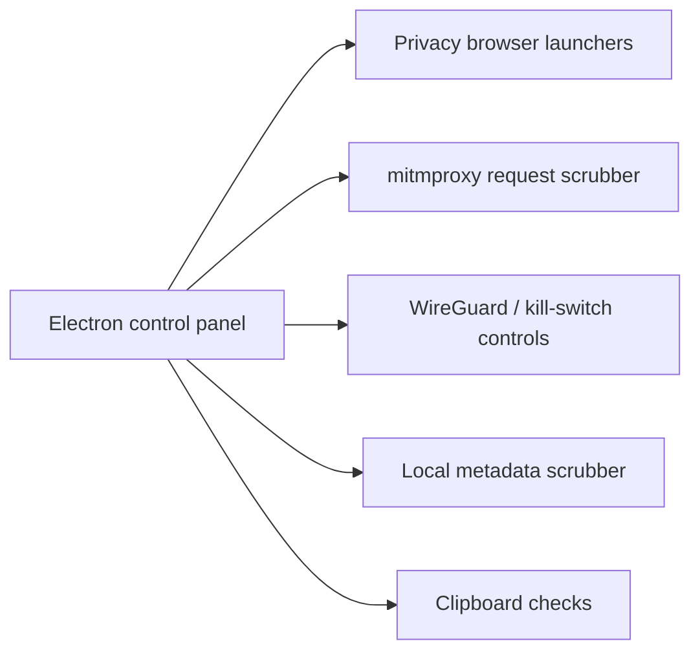

# Steel Wool

Steel Wool is a defensive privacy and network-safety prototype for reducing accidental data exposure on a workstation. It combines a small Electron control panel with request-header scrubbing, WireGuard controls, an optional network kill switch, local file metadata scrubbing, clipboard checks, and privacy-oriented browser launchers.

> **Status:** active prototype / rehab. Steel Wool is not an audited firewall, anonymity system, or production security boundary.

## What is here

- **Request sanitization** — a mitmproxy addon removes selected identifying or forwarding headers before requests leave the proxy.
- **VPN controls** — Linux-oriented WireGuard controls, with an opt-in public-IP monitor that can drop outbound traffic when the expected egress IP changes.
- **Metadata scrubbing** — local image rewriting for JPEG/PNG files.
- **Clipboard leak checks** — detects URLs and IPv4-looking strings before clearing them on request.
- **Browser launchers** — Chromium automation with direct and Tor-proxied modes.
- **Desktop shell** — Electron UI for launching and observing the components above.

## Architecture



The current implementation lives under `scubby/`; that directory name is historical.

## Safety defaults

The network kill switch is **disabled by default**. To enable it deliberately, set both:

```bash
export STEEL_WOOL_ENABLE_KILL_SWITCH=1
export STEEL_WOOL_EXPECTED_PUBLIC_IP="203.0.113.10"
```

If either value is missing, Steel Wool will not change the host firewall policy.

The project currently assumes Linux for WireGuard / iptables-backed network controls. Browser, proxy, and file-scrubbing pieces have different platform requirements.

## Run locally

### Requirements

- Node.js 20+
- Python 3.11+
- Chromium
- `mitmproxy` for request sanitization
- Pillow for image metadata scrubbing
- WireGuard and iptables only for the Linux VPN/kill-switch features
- Tor only for the Tor browser mode
- Xvfb only for headless Electron sessions on Linux

### Setup

```bash
cd scubby
npm install

python3 -m venv .venv
.venv/bin/pip install mitmproxy pillow

npm start
```

For a headless Linux session:

```bash
npm run start:headless
```

## Repository consolidation

Steel Wool is the canonical repository for this project. The former `Rubber` repository was an abandoned bootstrap/security-scanning shell with no implementation beyond repository configuration. Its useful security-scanning intent is being consolidated here.

## Current limitations

- The Electron shell still uses Node integration and needs a proper preload/context-isolation boundary.
- Network controls require elevated host permissions and have not been audited.
- The proxy scrubber removes a small fixed header set rather than enforcing a configurable policy.
- Image scrubbing is intentionally narrow and currently supports JPEG/PNG only.
- Automated tests are still sparse; CI currently focuses on syntax and static analysis.

## Direction

The rehab is intentionally incremental:

1. make the existing prototype safe to run and understandable;
2. restore CI/static analysis and remove dead repository scaffolding;
3. isolate privileged operations behind a narrow process boundary;
4. add tests around network-policy and metadata-scrubbing behavior;
5. document a concrete threat model before calling any component hardened.

## Defensive-use scope

Steel Wool is intended for privacy protection, local data-loss prevention, and defensive network controls on systems the operator owns or is authorized to administer.
